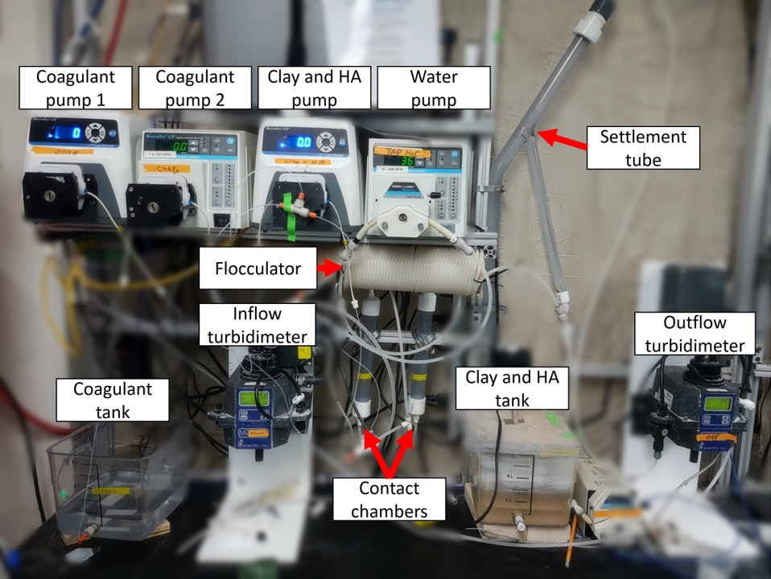

# 2 Stage Coagulant Addition, Spring 2018
#### Barbara Oramah, Ching Pang, Yuhao Du
#### April 14, 2018

<div class="alert alert-block alert-danger">
Why is the title not capitalized?
</div>

<div class="alert alert-block alert-danger">
Please do not delete my comments. Address them in the report and I will check them on the next submission. If you disagree with any of the comments, add your own comment under mine.
</div>

## Abstract

<div class="alert alert-block alert-danger">
Use full, complete sentences.

The ideas in the final sentence are key to your work this semester and is understandable.

Combine these four sections into one paragraph. An abstract needs to be cohesive and short/clear/concise. Keep it under 100 words. See the abstract description in the rubric.

</div>


**Apr 2 updated abstract:**
Based on the modelling result and bonding mechanism of humic acid, clay and PAC coagulant, we hypothesized that two-stage coagulant addition, namely a separate coagulant addition, would increase the particle removal efficiency. The first addition of coagulant offset the effect of humic acid in water while the second stream of coagulant aggregated clay. Using the same apparatus fabricated from last semester, we conducted experiment for both one- and two-stage coagulant addition. By comparing the particle removal efficiency of different coagulant addition methods, we aim to close the debate of one stage versus two stage.


## Introduction


Flocculation is among the most applied processes for water and wastewater treatment. Therefore, a thorough understanding of the physical and chemical process in flocculation is critical to the optimization of water treatment process, and so a predictive model to describe the flocculation process is needed.**/(basic definition)** However, the model built in the past research of AguaClara only considered the presence of clay and coagulant in water, and failed to take natural organic matters (NOM) into consideration. Natural organic matters, NOMs, are matters composed of organic compounds from the remains and waste products of organisms such as plants and animals and are ubiquitous in the natural water system. NOMs can be generated within the water source through biological activities, or introduced to the water body via drainage within watersheds, including substances generated during the breakdown of terrestrial organisms [(Hudson et al., 2007)](https://onlinelibrary.wiley.com/doi/abs/10.1002/rra.1005). The application of flocculation to remove NOM from drinking water supplies is efficient, and helps avoiding the formation of disinfection by products (DBPs).[(Mika et al.,2018)](https://www.sciencedirect.com/science/article/pii/B9780128015032000033) For processes based on the use of chemicals (e.g. coagulation and oxidation) and materials (e.g. adsorption), the increasing concentrations of NOM require the use of more chemicals or materials [(Xu et al. , 2016a)](https://www.sciencedirect.com/science/article/pii/S1385894715013406?via%3Dihub), which ultimately leads to the generation of more sludge or spent materials. Hence, the effect of NOM on flocculation is crucial in developing flocculation processes that optimize the operating conditions, including the amount of coagulants.**/(general incentives and problem of our research)**

In the past research, the original model that only takes coagulant and clay into account has been extended by considering the effect of NOM on flocculation. After studying the bonding mechanism between clay, humic acid (HA), and coagulant, it was found that smaller particles(e.g. humic acid, HA) move faster in the fluid than larger particles(e.g. clay). Thus, in synthetic water composed by clay, HA and coagulant, HA collides and attaches to coagulant before clay. Once the coagulant surface is occupied by HA, the coagulant performance decreases because the occupied surface cannot attach to clay or nano-aggregate. It was assumed less coagulant is needed when it is added separately, a so-called two-stage coagulant addition, meaning the coagulants are added at two different stages of the treatment process.**/(state our hypothesis)** During the first stage, the coagulant is added to offset the effect of humic acid in water; then in the second stage, the second stream of the remaining coagulant can aggregate clay, which joins the nano-aggregate formed in the first stage, and small particles to form big flocs. It was assumed that after the first stage, all coagulant would be coated by humic acid. Thus, the coagulant added in second stage can function simply as an agglomerant to achieve better performance in aggregation.**/(explain our hypothesis)** Furthermore, if the coagulant dosage can be guided by a predictive model, operating conditions of flocculation process can be optimized and coagulant can be used more efficiently. Since AguaClara is an engineering project team focuses on sustainable drinking water supply in developing region, cost is a main concern. Therefore, using less amount of total coagulants in a two-stage settings is beneficial that it reduces the operational cost of water treatment plants.**/(prospective contribution to AC team)**

Last semester, our model considered the attachment efficiency for the hydraulic flocculation. However, past studies have investigated the difference of efficiency of two-stage coagulant addition, meaning adding the coagulants at two different points, comparing with one-stage. [(Liu et. al., 2011)](https://ieeexplore.ieee.org/document/6847925/) Keeping the total amount of coagulant at the same dosage, when partial amount was added half-way, it was found that two-stage can produce floc 1.5 times the floc size comparing with one-stage, which potentially made two-stage more efficient to one-stage. As the floc blanket was formed, the flocs were connected together to form larger and more irregular structure, making two-stage addition more time and cost efficient than one-stage.

In this report, findings in literature review and our group's previous work are discussed, as well as the experiment design and apparatus set-up of our team in this semester. Findings and conclusion based on our experiment data and analysis are described at the end of the main body. Details in experimental operation such as ProCoDA setting, chemical dosage calculation, experiment process can be found after the main text.

<div class="alert alert-block alert-danger">
Good content detailing the importance, but issues with technical writing.Good connection back to importance on cost and resource availability and description of why 2 stage coagulant addition may work. The overall description of the project would be confusing to anyone who hasn't heard about it before. Keep in mind your audience is a new member on the team. So think what did you need to know to understand this and then include that info.
</div>

## Literature Review and Previous Work

### Previous Work of AguaClara Project Team
The research of Yingda Du, a previous graduate student on the project team, explored the effects of NOM on flocculation. Her thesis [(Du, 2017)]() determined the effects of humic acid on the particle size distribution of flocs and settled effluent turbidity for a synthetic surface water treated with polyaluminum chloride (PACl) as coagulant. The results from this thesis showed that presence of NOM increased the concentration of flocs and shifted the particle size distribution toward smaller particle sizes with a concurrent increase in the effluent turbidity. A mechanistically based hydraulic flocculation model, which took effects of humic acid into account, was developed in this research based on the observations of residual turbidity. The model was validated by successfully predicting data from independent experiments. The predictive model provided a useful guideline for effective coagulant dosages in water treatment.

Our research was based on her study of bonding mechanism between different particles in water. There are three different kinds of particle in our research model, they are clay, humic acid and coagulant nanoparticle. As it was shown in Figure 2, there are six kind of possible collision. However, only collisions with coagulant involved can occur in reality, because clay and humic acid are not sticky, they can not attach to each other or themselves.


    Figure 1： Collisions between particles during flocculation

### Previous Work of Two-Stage Coagulant Addition Subteam
In Fall 2017 semester, TSCA (two-stage coagulant addition) subteam built the theoretical basis for future work by studying research report of previous particle removal research teams in AguaClara and relevant literature online. TSCA built their apparatus based on the design of Contact Chamber subteam. The mechanisms related to the contact chambers can be found in the Contact Chamber subteam report. Compared with the previous group, the set-up includes five pumps to achieve a precise control of fluid flow rate. Two down-flow contact chambers were applied in series before the fluid enters the flocculator. The contact chambers created a space for particle collision to take place. The apparatus set-up of Spring 2018 semester was based on the previous design and the detail will be explained in depth in later chapters.

Studying the operation of ProCoDA software was another critical task the subteam accomplished in Fall 2017 semester. ProCoDA, a process control software, allows the user to control many parts of the experimental apparatus and to automate data collection. Specifically, ProCoDA can control the speed of peristaltic pumps, regulate flow through solenoid valves, and measure water quality parameters such as turbidity by connecting to the turbidity meter. Automated data acquisition can record the speed of pumps, the turbidity of water, the mass of container to an Excel spreadsheet directly. The resulting data were analyzed with Excel and Python codes. Using the increment function built in ProCoDA enable the team to conduct series of control experiments without staying in the lab. More detail of our experiment will be discussed in the Method section of our report.**/(processing)** The original MathCAD base code used to calculate coagulant dosage, the composition of clay-HA mixture and pump speed was translated to Python codes, the code is attached to the main text.

According to the generated data, two-stage coagulant addition need more time to form floc blanket than one stage addition. But in several trials with relatively low turbidity, one stage addition can not form floc blanket while the two-stage addition could under the same condition.


### Literature Review

The optimal operating conditions to reduce turbidity by flocculation, such as pH and coagulant dosages, might not be the same for NOM removal. [(Yan et al., 2008)](https://www.sciencedirect.com/science/article/pii/S1383586609002342?via%3Dihub)  Flocculation reduces the repulsive potential of electrical double layer of colloid by using coagulants. As a result, colloidal microparticles develop and then agglomerate into larger flocs. This agglomeration phenomenon includes various mechanisms with the coagulant's metal ions into insoluble aggregates[(Henderson et al., 2006)](https://www.scopus.com/record/display.uri?eid=2-s2.0-33744489650&origin=inward&txGid=aaab348399699d2ac6549079332441da). Considering the high variability of NOM's organic components in different water sources, the removal mechanisms will substantially differ from one water source to the other or within the same source due to seasonal variations. The result will therefore be a variable removal efficiency of coagulation and the formation of flocs with different sizes and structures [(Jarvis et al., 2006)](https://www.sciencedirect.com/science/article/pii/S0043135406002405?via%3Dihub), which urges researcher to develop different water treatment strategy in different contexts.

The presence of NOM in water has notable effects in the dispersion of clay particles. This can be seen when using the particle-size distribution (PSD) calculations on water with NOM present. [(How to calculate can be found here)](https://www.innopharmalabs.com/tech/applications-and-processes/particle-size-distribution) There is a frequency increase in the nanoaggregate in comparison to a mixture with clay alone. This is attributed to the fact that humic acid and clay both have negatively charged surfaces, however humic acid's surface is significantly more negative. This then creates repulsive forces between the particles thus increasing the number of particles.[(Kretzschmar et. al)](https://dl.sciencesocieties.org/publications/sssaj/abstracts/61/1/SS0610010101)

Polyaluminum Chloride (PAC) was chosen to be the coagulants of our research, because of its compatibility with a majority of NOMs, low sensitivity to temperature and low residual metal-ion concentration. The effect of PAC in removing humic acid was significantly efficient comparing to other chemicals. [(Sudoh et. al., 2015)](https://www.sciencedirect.com/science/article/pii/S2213343715000871) Projects prefer using PAC also because of the economic factor(i.e. low cost and high availability in both solid and liquid form). [(Bratby,2006)](https://www.sciencedirect.com/science/refhub/S0045-6535(17)31538-2/sref15)

Coagulants usually function as neutralizer and destabilizer in the particle removal process. As far as NOM is concerned, the flocculation-based removal process is more efficient when more positively charged aluminium (Al) species are generated because NOM is mainly composed of organic compounds with negatively-charged functional groups. As shown in Figure 2, originally, the negatively charged solids particles repel each other. However, as positively-charged coagulants are added to the mixture, they adhere to the negatively charged colloids, and neutralize the charge and destabilizing the particles. With the removal of charge, the destabilized colloids can now adhere to each other, forming microflocs.


    Figure 2： Coagulants function as neutralizer and destabilizer

<div class="alert alert-block alert-danger">

Consider " Polyaluminum Chloride (PACl) is a coagulant that reduces DBPs..." rather than being associated with Coagulation

Focus on the important information to pass along.
</div>


<div class="alert alert-block alert-danger">
Sometimes you use humic acid and sometimes you use Humic Acid. Be consistent with capitalization (I would say humic acid is more correct)

I don't understand the first sentences

What is attachment efficiency for the hydraulic Flocculation

Where are these results coming from? Source?

Why is two-stage more efficiently

Combine all these above sections into one lit review/previous work without all the separate headers.

This section needs a lot of work for understandability.
</div>

## Methods

### Experiment Process

#### Materials

* **Humic acid** -  the representative NOM. It is the most commonly found  NOM in the natural system.
* **Kaolin clay** - represents the colloidal solids.
* **Polyaluminium chloride (PAC)** - the coagulant.

#### Variables

##### Control Variables
* **Influent Turbidity** - the influent turbidity value TSCA team evaluated was 100 NTU.
* **Coagulant Dosages** - the increment function used in ProCoDA increased the coagulant dosage stepwise. When the run time of current state reaches the duration set in ProCoDA, the function will be activated and increase the coagulant pump speed according to the setting. Details about ProCoDA set-up can be found after the main text.

##### Independent Variables
* **Concentration of Humic Acid**
* **Concentration of Kaolin Clay**

##### Dependent Variables
* **Effluent Turbidity** - the effluent turbidity showed the efficiency of particle removal in the system.
* **Optimal Coagulant Dosage**


Throughout the semester, a series of one-stage coagulant addition experiments was carried out to find the optimal coagulant dosage that could reduce the effluent turbidity of 3 NTU or less, the required turbidity for the AguaClara's filter system. During the one-stage experiments, the second coagulant pump was turned off.

In two-stage coagulant addition experiments, each dosage of coagulant used in one-stage addition experiment was divided into two parts by adding one more stream of coagulant between the first and second contact chamber. The goal of two-stage experiment was to find the optimal distribution between the first and second stream coagulant. The desirable situation was that most of the coagulant from the first addition would offset the effect humic acid in the water, and coagulant from the second addition would be able to attach to clay and nanoaggregate, thus forming big flocs and reducing the effluent turbidity effectively.

A T-connection as shown in figure 3 was installed between the two coagulant pumps to help manage the amount of coagulant that was input into the system. The first pump would control the total amount of coagulant being put into the system through the left valve to the right valve. When the second coagulant pump was opened, it would control how much coagulant is used for the second dosage, draining directly from the left valve to the top valve so that a fixed dosage of the total amount of coagulant used. This can test whether having second addition of coagulant before the second contact chamber would have a better performance with the same dosage of coagulant used in one stage coagulant addition. Coagulant flows in through the left valve and is separated into two streams by the top and right valve as the first and the second addition respectively.


    Figure 3：T-connection used in two-stage experiment to separate the two streams of coagulant.


Once ample data of the effluent turbidities of both one-stage and two-stage coagulant addition has accumulated, we will determine which method is more beneficial.  


<div class="alert alert-block alert-danger">
"Finally, we decided to carry out the following procedure" - This sentence is unnecessary, keep focusing on clear and concise writing.

Avoid the words "would", "should", etc. In the words of Yoda "Do or do not, there is no try"

Firstly - why not say "First.."

Watch out for run-on sentences. They make it very hard to read and understand.

I am having a hard time visualizing the T-connection between the coag pumps and the set-up in general. Do you have a photo of the set-up? I am not understanding the rationale about dosaging between the two-stages as described by the latter half of the paragraph.
</div>

### Experimental Apparatus Design
ProCoDA (Process Control and Data Acquisition) software was used to automate data collection and control the experimental apparatus. Two up-flow contact chambers are set before the fluid enters the flocculator, so that the coagulants are allowed more time and space to collide with particles in water. During the first stage of addition, in the first contact chamber, coagulants collide and they are covered by humic acid. In the primary stages of setting up the apparatus, the pump was designed to input the correct coagulant dosage before each contact chamber, allowing for two-stage coagulant addition to take place. However, due to the limitations of ProCoDA, we can only control a maximum of two pumps at the same time. The second coagulant pump has to be controlled manually.

<div class="alert alert-block alert-danger">
First sentence is a run-on. Do not include "should" in that sentence because there either are or are not.

I don't fully understand what's going on with the second pump draining from the first pump.

Define ProCoDA
</div>

The general apparatus set-up developed from last semester was kept throughout this semester. The contact chamber was reversed from down-flow to up-flow so that all the air in the system can be pushed out. Due to the limited space on our bench area, we had to make simplifications in our apparatus set-up. Nevertheless, the simplifications reflect the nature of the AguaClara water treatment plant. The sedimentation tube in our system had the fundamental structures of what would be present in an AguaClara water treatment plant, including the floc weir, floc settler, floc blanket and sludge valve. Further detail about the design of sedimentation tube can refer to the research of High Rate Sedimentation group in AguaClara. A tube flocculator was used in this research because it can be idealized as a high-Péclet-number reactor much like a baffled hydraulic flocculator and also because the average velocity gradient in laminar tube flow is well defined [(Weber-Shirk and Lion 2010)](https://www.sciencedirect.com/science/article/pii/S0043135410004136).

<div class="alert alert-block alert-danger">
Any calculations?

Consider a clearer way to present this information
</div>


    Figure 4：Apparatus diagram



    Figure 5: Current Apparatus Set-up


Since ProCoDA can only control two pumps, one of the coagulant pumps had to be connected to the system. Thus, humic acid and clay cannot be added into the system under the control of two independent pumps. To start with running our apparatus, clay, humic acid and water were added, according to the calculated amount, into a 10L stock tank with a stirrer. This stock tank was connected to the clay pump. The pump speed was controlled by ProCoDA to maintain a relatively fixed influent turbidity. After that, a mixture of humic acid and clay went through the first turbidity meter, and influent turbidity of the raw water was measured. Following this, the first stream of coagulant was added right before the fluid entered the first contact chamber. The second stream of coagulant was pumped into the system after the first contact chamber if we were running a two-stage addition experiment.


<div class="alert alert-block alert-danger">
"The way in which the apparatus worked was the following" is both an incomplete sentence and too fluffy. Instead say how the apparatus worked in that first sentence.What calculation?Do you mean stirrer?How did you determine the pump speed for the fixed turbidity?What was that turbidity?Can the results from one experiment with a certain fixed turbidity be generalize for many turbidity levels?Turbidimeters not turbidity TurbidimetersChoose between is and was - have to keep tenses consistent.More run-on sentences and incorrect verb usage.The end of this paragraph is a better description of how the two stage dosing worked.
</div>


<div class="alert alert-block alert-danger">
Delete the bullet point for "Image"
Refer to figures by their figure number.
Figure number? Why don't you include this farther up?
Are the current simplifications justified? Is the data you are getting reliable?
</div>

Table 1: The bench setup. Parameters and resulting values of the current design.

| Parameter | Meaning | Value |
| ----- | ------------------------ | ----- |
| V.Sed | Sed Tank Upflow Velocity | 1 mm/s |
| D.Sed | Sed Tank Inner Diameter  | 1 in  |
|Q.Sed, Q.Reactor| Flow rate (from V.Sed) |1.52 mL/s|
|D.Floctube|Floctube Inner Diameter| 0.17 in |
| Gtheta | G*theta | 20,000 |
|  G  |  Shear   |  175.5 Hz  |
|Theta |Residence Time | 1.899 min or 113.9 s|


### Experiment operation
Two-stage coagulant addition experiment is based on the data generated in one stage addition experiment, and the total coagulant dosage is the optimal amount found in one stage addition experiments. Two additional dosages of coagulant are added for comparison by varying +/-0.5 of the optimal dosage based on the first-stage results. When conducting two-stage addition experiment, the effect of humic acid concentration on flocculation is not tested, and humic acid concentration of the synthetic water is kept constant.

In March, for one-stage addition experiments, the coagulant dosages ranged from 1.1 to 2.6 mg/L in every circulation of the increment function (incrementing coagulant dosage by ProCoDA). The dosage was increased seven times over time under the control of ProCoDA. The target influent turbidity kept at 100 NTU and the humic acid concentration was constant at 2 mg/L. Trials using pure clay suspension (no humic acid) were also conducted for comparison. It was found that the desirable effluent turbidity and floc blanket (Fig. 5) was usually generated around 1.5 mg/L of coagulant concentration. Besides, in the previous experiments, 0.5mg/L and 1mg/L coagulant were insufficient to reduce the turbidity of synthetic water efficiently. By applying different humic acid concentration between separate trials with same coagulant dosage, the effect of both humic acid on flocculation process was tested.

<div style = "text-align:center">


    Figure 6: Floc blanket forming in the reactor


</div>
In April, the humic acid concentration used in the experiment was decreased to guarantee the formation of floc blanket in every trial. Synthetic water without humic acid was used in research to compare with HA and clay synthetic water. By doing so, we can study the effect of humic acid on the distance between clay particles. Our group conducted series of control experiment for two stages addition, aiming at discovering the most effective ratio of coagulant allocation between the first and second stage. In the future, after generating enough data, the overall particle removal efficiency of one-stage and two-stage addition will be compared.

<div class="alert alert-block alert-danger">
coag is informal, use coagulant Insteadput a space between values and their unit_registryDo not use colons in the middle of sentences - does not make senseWhy are you redifining who Yingda is again?Include units on every numberWhat is the increment function?Unclear what the last sentence means
</div>


## Results and Analysis
### Impact of humic acid on flocculation
The experiment data of one stage addition experiments in the beginning didn't align with the expectation and experimental results in the past semester. It was expected that the floc blanket could be found in our sedimentation tank each time we ran because the minimum coagulant dosage we used at that time was 1.5mg/L, which would be enough to reduce the effluent turbidity to 15 or less NTU according to past research. Besides, the goal of the flocculation and sedimentation system was reducing the water turbidity to 5 NTU or less, so that the water can be treated by AguaClara filtration system, which was unable to effectively treat water with 5NTU or higher turbidity. In some of our trials, the effluent turbidity was range from 70NTU to 80NTU, which suggested that only the tube flocculator contributed to the particle removal. Several possible causes of the failure was raised, and following paragraphs will discuss how we tested them.

One assumption was that due to the limit time of data acquisition state(detail explanation of ProCoDA set points can be found after the main text), the system did not have enough time to form the floc blanket. We extend the duration of data acquisition state, from 3600 seconds to 4800 seconds, and finally it was 8000 seconds. According to our observation, dense floc blanket usually formed one hour after the coagulant was added. If there was no floc blanket formed within two hours in a trial, it won't form over time.

The effluent turbidity did not vary a lot even though the increment function worked, after examining the data we found that the coagulant pump actually worked around its lowest speed, and the past research showed that our pump did not work well at that speed. Therefore, for future experiments, we are going to set a higher intercept for the increment function, so the lowest rpm in our experiment now is 39.


    Figure 7: Floc Model result at 100NTU

### Impact of surface charge
Due to the limit port in our hardware, our group had to mix the clay and humic acid before pumped them into water. This set-up can have two possible outcomes. If the clay can cover by the humic acid when stirring in the stock tank, there should be a suspension which is easier to remove, because the amount of humic acid is reduced. But according to our observation, suspension with humic acid was harder to be removed than the single clay turbid solution. So here comes the second hypothesis. Both clay and humic acid is negatively charged, while humic acid has a higher charge density. It was hypothesized that due the prior mixing, the charge density of clay particles increase after attached by humic acid and they will become more repulsive to each other, thus the clay suspension is more dispersed, surface area of clay was increased, the suspension was harder to be removed by flocculation. According to our observations, suspension with humic acid did require more coagulant to be removed when compared with single clay suspension.  


    Figure 8: Experiment outcome with and without humic acid

    | Parameter | Value |
    | --------- | ----- |
    | Coagulant Dosage|2.4mg/L-2.7mg/L |
    | Humic Acid Concentration | 0mg/L, 2mg/L |
    | Target Influent Turbidity|  100NTU  |
    | Up Flow Velocity| 2mm/s|

### Impact of coagulant dosage
Regarding the effect of coagulants dosage, determining the optimal amount is crutial. Overdosing the coagulant would result in a substantial increase in the amount of generated sludge and a decrease in pH, while a lower dose is generally the cause for the residual metal remaining in treated water[(Ibrahim and Aziz, 2014)](http://www.ijsrpub.com/uploads/papers/IJSRES/IJSRES-2014/Mar/IJSRES-13-111.pdf). Increasing the alum dose has been shown to increase NOM removal up to a certain point; however, NOM removal is not significantly improved when adding very high alum dosages, which suggests that some components of NOM are recalcitrant to being removed by coagulant.


    Figure 9: Experiment result with different coagulant dosage


| Parameter | Value |
| --------- | ----- |
| Coagulant Dosage|1.5mg/L-2.8mg/L |
| Humic Acid Concentration | 8mg/L |
| Target Influent Turbidity|  100NTU  |
| Up Flow Velocity| 2mm/s|

    Table 3: Experimental Parameter


Under the control of increment function, coagulant dosage in our experiment increased over time. Figure 8 shows the experiment data of one stage addition trial, which can be used to study the effect of coagulant dosage on floc formation. The influent turbidity is 100NTU. Effluent turbidity reached the peak during the flush state, when floc blanket was washed out. Then it reduced steadily after the system switched back to data acquisition state, the floc blanket formed after coagulant entered the system(detail explanation can be found after the main text). As shown, with the stepwise increase of coagulant dosage, the effluent turbidity dropped faster. This suggests that the floc blanket formed faster with higher coagulant dosage, which is aligned with our observation.


<div class="alert alert-block alert-danger">
What is going on with these datalogs and the code? Is that a remnant of the template? It is unprofessional looking.
</div>


<div class="alert alert-block alert-danger">
Why is this formatted in a bulleted list with questions? It should be written in formal paragraphs as a normal research report would contain.

What are thefull results of your several trials completed of one stage addition? Are there any graphs? Any preliminary findings?

What does the duration change?
</div>

### Analysis of One Stage Coagulant addition procedure
A primary concern was the lack of consistency in the formation of a floc blanket in our sedimentation tank during 1-Stage coagulant addition. Due the limitations of ProCoDA, clay and humic acid had to be mixed before it entered into the system.


<div class="alert alert-block alert-danger">
I get that pump speed is an issue here but I don't know why. What determined the rpms of your pumps? Why is 20 NTU a bad result?

This sections needs much more development and polishing.
</div>

## Conclusions

At this point, we fully understood the ProCoDA system and could use the increment function to carry on set of control experiments with fixed turbidity and different coagulant dosage. Also we had implemented an electronic balance which also connects to the ProCoDA system to track the mass change of coagulant over time. It could offer us data to confirm our ProCoDA code will guide the pump to add coagulant to the amount we calculate.

Generally, we deduced that by using the current design of system, when the turbidity is relatively low, we will need more coagulant to reach the target effluent turbidity. In this experiment, our target effluent turbidity should be no more than 3 NTU, which is already expected with the standard AguaClara system.

The calculation of coagulant dosage and the component of clay-humic acid mixture could be done on python now, we transferred the original MathCAD base code and translated it into python. Moreover, the team must gain a deeper understanding of how the the pre-mixed mixture of clay-humic acid can be removed at a successful rate, regardless of the ratio of HA to clay. This is a critical task as in essence our research goal is to be able to model our experiment in different scenarios. This should be applicable to both one stage and two stage coagluant addition.

In the rest semester, we would keep running both one stage and two stage experiment.

If we validate our 2 stage hypothesis, we could use this model to guide the dosage in water treatment plant and save the coagulant, cut down the operational cost.

<div class="alert alert-block alert-danger">
This section should be more tailored to your research question and not what you have learned about the set-up and other constraints.

The conslusion in the second paragraph is not supported adequately in your report.
</div>

## Future Work
The current apparatus design is shown deficient by the contact chamber group because the two up-flow contact chambers applied can't function as what they designed to be. Experiments demonstrated that the current design of contact chamber could not necessarily reduce the wall loss of the coagulant and improve the particle removal efficiency. Although right now we only use the contact chamber as a place for particle collision and divide the first and second stage addition physically, it would increase particle removal efficiency if in the future we can modify the design of contact chamber. Currently, AguaClara uses a tube contact chamber since it can be easily fabricated by cutting a PVC tube. Without changing the design, we can test the effect of contact chamber with different length and diameter.  

Effect of pH has not been considered in out current research. However, pH could be the single most crucial factor affecting the effectiveness of metal-based coagulants[(Qin et al., 2006)](https://www.sciencedirect.com/science/article/pii/S1383586605003187?via%3Dihub). In the future, pH can be measured during the experiment by both pH meter and pH test paper. In either water treatment plant or apparatus in the lab, pH can be adjusted by applying different chemical reagent, and varying pH will allow us to see the effect of pH. On the other hand, experimental process can simulate the environment of water treatment plant if we can keep the pH value align with the water in our plant.

The predictive floc model developed by AguaClara is based on the past apparatus set-up and experiment process. Without considering the presence of floc blanket and the use of new tube sedimentation tank, the model can not simulate the current experiment, and it modeling result deviates a lot from present experimental data. The ultimate goal of our group is to revise the model to make it well aligned with the experiment in the lab so that the up-to-date research findings can guide AguaClara water treatment plant.


<div class="alert alert-block alert-danger">
Section has sentences that are incomplete.

The size o the contact chamber is not discussed in report. There should be no new info in the conslusion and future work sections.

How do you design the contact chambers?
</div>

## Bibliography
Du, Yingda. 2017. “Observations and a Geometric Explanation of the Effects of Humic Acid on Flocculation.” Cornell University.

Henderson, R., Sharp, E., Jarvis, P., Parsons, S., Jefferson, B., 2006. Identifying the linkage between particle characteristics and understanding coagulation per- formance. Water Sci. Technol. Water supply 6, 31e38.

Hudson, N., Baker, A., Reynolds, D., 2007. Fluorescence analysis of dissolved organic matter in natural, waste and polluted waters - a review. River Res. Appl. 23, 631e649.

Knauer, K., Homazava, N., Junghans, M., Werner, I., 2017. The influence of particles on bioavailability and toxicity of pesticides in surface water. Integr. Environ. Assess. Manage. 13, 585e600.

Kretzschmar, R. , Sticher, S., Hesterberg, D., 1997 Effects of Adsorbed Humic Acid on Surface Charge and Flocculation of Kaolinite

Jarvis, P., Jefferson, B., Parsons, S.A., 2006. Floc structural characteristics using conventional coagulation for a high doc, low alkalinity surface water source. Water Res. 40, 2727e2737.

Liu, Ting et al. 2011. “Effect of Two-Stage Coagulant Addition on Coagulation-Ultrafiltration Process for Treatment of Humic-Rich Water.” Water Research 45(14): 4260–68.

Logan, B. E., Hermanowicz, S. W., & Parker,A. S. (1987). A Fundamental Model for Trickling Filter Process Design. Journal (Water Pollution Control Federation), 59(12), 1029–1042.

Qin, J.J., Oo, M.H., Kekre, K.A., Knops, F., Miller, P., 2006. Impact of coagulation pH on enhanced removal of natural organic matter in treatment of reservoir water. Sep. Purif. Technol. 49, 295e298.

Sillanpää, M., Matilainen, A., (2015). Natural Organic Matter in Water: Characterization and Treatment Methods, 55-74.

Sudoh, Ryou et al. 2015. “Removal of Dissolved Humic Acid from Water by Coagulation Method Using Polyaluminum Chloride (PAC) with Calcium Carbonate as Neutralizer and Coagulant Aid.” Journal of Environmental Chemical Engineering 3(2): 770–74.

Weber-Shirk, M. L., and Lion, L. W. (2010). “Flocculation model and col- lision potential for reactors with flows characterized by high peclet numbers.” Water Res., 44(18), 5180–5187.

Xu, Y., Chen, T., Liu, Z., Zhu, S., Cui, F., Shi, W., 2016. The impact of recycling alum- humic-floc (AHF) on the removal of natural organic materials (NOM): behavior of coagulation and adsorption. Chem. Eng. J. 284, 1049e1057.


, M., Wang, D., Ni, J., Qu, J., Ni, W., Van Leeuwen, J., 2009. Natural organic matter (NOM) removal in a typical North-China water plant by enhanced coagulation: targets and techniques. Sep. Purif. Technol. 68, 320e327.

<div class="alert alert-block alert-danger">
What/Where are your sources? (including Yingda's thesis)
</div>

## Fabrication Details
Most of the fabiracation of bench area apparatus was completed in last semester, the connection between different part is described in the experiment apparatus part. The fabrication of contact chamber can refered to the report of contact chamber group.[Contact Chamber]()


## Experimental Methods

### Experiment
**Step 1.** Fill stock tanks. One stock tank should be filled with a diluted solution of PAC coagulant, and the other should have a mixture of water, clay, and humic acid. The concentration of solution depends on experiment objectives and can be calculated by using the chemical dosage calculation code below.


**Step 2.** Once the solution is prepared, open the water and wastewater valves, turn on turbidity meters, and let the apparatus completely filled with water, the experiment is now ready to run. Be sure to turn on the sludge pump, a 1L/s pump next to the effluent turbidimeter, to ensure that sludge is drained to the wastewater line.

**Step 3.** Check important set points in ProCoDA. Set target influent turbidity, duration of data acqusition state and flushing state.


**Step 4.** Open the ProCoDa software and turn the "operation state" from OFF to ON, to turn on the clay pump so the influent turbidimeter will soon reach the target influent turbidity. Once the influent turbidity fluctuate around the target influent turbidity, go back to ProCoDA and switch the state from "ON" to "Data acquisition state", the coagulant pump will be turned on. Then switch the operational mode from "Mannual" to "Auto Switch".

**Step 5.** The data acquisition state will go back and forth with the flush state, which is used to wash out the floc blanket. The data will be recorded on spreadsheet for further use.

**Step 6.** Once the the data collected, check the datalog and turn off ProCoDa. Proceed to the cleaning procedure when experimentation is finished.

<div class="alert alert-block alert-danger">
Check formatting and the technical writing.

Where can I get info on making clay stocks?
</div>

### Cleaning Procedure
 Once the experiment is done, we want to completely wash out the apparatus so it will be ready for the next experiment.

**Step 1.** Turn off the clay and coagulant pump while let the tap water pump run at a relative high speed.

**Step 2.** Remove entire apparatus from wall (recirculator \& tube settler) and throughly wash it out, then reattach it back to the wall.

**Step 3.** Wash out the Flocculator by unplugging the connection between the the outflow tube from the influent turbidimeter and the flocculator, and plug in tubing from the nearby sink to wash out the flocculator. Make sure there is a bucket at the end of the flocculator that will collect the water.

**Step 4.** Clean the influent and effluent turbidimeter. Make sure to turn on the Bypass channel first! First, open the bypass valve. Second, pinch the black outflow tube.

**Step 5.** Remove and wash out the vials from both turbidimeters. Refill the vials with clean water, then put back into the turbidimeters. Use Kimtech wipes to clean the glass throughly.

<div class="alert alert-block alert-danger">
Do you mean kimtech wipes?
</div>

**Step 6.** Turn off water to the flocculator and detach the tubing. Hook up the influent turbidimeter back into flocculator then re-open the influent turbidimeter BUT keep the effluent turbidity meter closed. Turn on the water pump to clean out the influent turbidimeter as well as the flocculator.

**Step 7.** Pour out the coagulant reservoir into a different bucket and rinse reservoir with deionized water to make sure all residue is washed out. Take out the push pin then wash out the coagulant reservoir throughly. Replenish reservoir with 5L (or less) of deionized water. Use MathCAD to determine how much 70.9mg/L PAC coagulant needed to use to get the desired results for the experiment.

<div class="alert alert-block alert-danger">
Where can I find info on how to set-up the apparatus?
</div>

## Experimental Checklist
Before running the experiment, we check apparatus following steps below:

**Step 1.** Turn on the influent and effluent turbidity meter and check whether the inside glass container is clean;

**Step 2.** Before reassemble the turbidity meter again, we turn on only the water pump and let tap water run through the system to see if their is any leak in the system, especially near the turbidity meter, in case water would flow to interior of the meter and cause damage to the apparatus;

**Step 3.** Turn on all pumps and set them with a tiny RPM value, then check if pumps run in the right direction;

**Step 4.** go to the "edit rules" part of the ProCoDA, check the parameter of increment function, make sure those valve are set according to the calculation;

**Step 5.** The last step, turn to "operation" part of ProCoDA, start the system with "Data Acquisition States" and make sure states would switch between one another automatically.

<div class="alert alert-block alert-danger">
Keep list formatting consistent with sections above.

Good checklist
</div>

## ProCoDA Method File

### States

**{OFF}** - Resting state of ProCoDA. All sensors, relays, and pumps are turned off.

**{ON}** - ON state of ProCoDa. All sensors, relays, and pumps are turned on.

**{Data Acquisition}** - State 3 of the experimental process where the coagulant pump is working and the increment function would increase its value each time when we switch to this state. The data acquisition state usually set to be 2 hours, which is enough for the floc blanket to form.

**{Flush}** - State 4 of the experimental process where the coagulant pump stop working, during this stage raw water would run through the system and flush out the floc blanket build in last data acquisition state, so that every data acquisition state would run with same original system condition.


### Set Points

**{Turb target}** - The value of our target influent turbidity, ProCoDA will control the clay pump to maintain the target influent turbidity.

**{pump control(clay)}** - Use this set point to decide which pump should we control.

**{Flush Time}** - Duration of the flush state.

**{Data Acquisition Time}** - Duration of the data acquisition state.

**{State to Increment}** - Tell the increment function when to increase its value, in this experiment, we use increment function to control coagulant pump speed.

**{Slope}** - The slope of increment function.

**{Intercept}** - The intercept of increment function.

**{Max x}** - How many time would the increment function work during one circulation.

**{coag pump control}** - Use this set poiont to decide which coagulant pump should we control.

**{coag pump property}** - Flow rate per revolution.

**{balance}** - Variable with value returned by the electrical balance.


 ## Python Code

 ### Variables
 $g$: gravity
 $\sigma$: dispersion
 $a$: amplitude
 $h$: water depth
 $H$: distance from wave crest to trough (2$a$)
 $T$: wave period
 $\lambda$: wavelength
 $k$: wavenumber
 $c_p$: celerity (wave phase speed)
 $P$: pressure
 $F$: force
 $u$, $w$: x-velocity, z-velocity components

### Chemical dosage and pump speed calculation
 ```python
 # build the environment
import numpy as np
import pandas as pd
import matplotlib.pyplot as plt
from aide_design import physchem as pc
from aide_design.units import unit_registry as u
from aide_design import utility as ut

# calculate the flow rate of the system and water pump speed
V_sedimentation_upflow = 1*(u.mm/u.s)
InnerDiam_SedTube = 0.96*u.inch
Area_SedTube = 0.25*np.pi*(ID_pipe**2)
Q_system = V_sedimentation_upflow*Area_SedTube

print('The flow rate of the system is', (ut.sig(Q_system.to(u.mL/u.s),3)))

WaterPumpQperRev = ((52*u.ml/(20*u.rpm)))/(0.5*u.min)
WaterPumpSpeed_perSecond = (Q_system/WaterPumpQperRev)*(60*u.s)

print("The water pump speed is ",WaterPumpSpeed_perSecond.to(u.dimensionless))

# Calculate the mass flow of coagulant
# desired conc of PAC per L of water in the system. (0.5-2.5mg/L)(normally fixed range)

conc_PACL = 1.5 * (u.mg/u.L)

MassFlow_coag = conc_PACL*Q_system

print('The mass flow of coagulant in the system is',ut.sig(MassFlow_coag.to(u.mg/u.s),3))

# how many mL of lab concentration are added per L into the reservoir(adjustable)
k_dilution = 3.80*(u.ml/u.l)

# concentration in grams per L of lab solution(normally fixed value)
conc_labsolution = 70.9*(u.g/u.L)
conc_tank = conc_labsolution*k_dilution
Q_coagtank = MassFlow_coag/conc_tank
V_coagtank = 2*u.L
V_lab_solution = V_coagtank*conc_tank/conc_labsolution
print('The volume of lab concentration solution we need to add into the tank is',ut.sig(V_lab_solution,3))

# calculate the relevant pump speed, so that we can set our increment function

# The flow pumped out of the pump per round(measured by experiment)

Q_perrev_coag1 = 0.003979*(u.ml)
Q_perrev_coag2 = 0.02604*(u.ml)
#Q_perrev_coag1 = 0.0173*(u.ml/u.s)
# Q_perrev_coag2 = 0.103*(u.ml/u.s)
numRPM_coag1 = Q_coagtank/Q_perrev_coag1*(60*u.s)
numRPM_coag2 = Q_coagtank/Q_perrev_coag2*(60*u.s)
print('The pump should run with a speed of',numRPM_coag1.to(u.dimensionless))
print('The pump should run with a speed of',numRPM_coag2.to(u.dimensionless))

# concentration of the clay
turbidity_target = (100*u.NTU)
print(ut.sig(turbidity_target.to(u.g/u.L),3))

# concentration of the humic acid
conc_HA = 8*(u.mg/u.L)
print(conc_HA.to(u.g/u.L))

# clay&HA in tank
# the concentration of the solution in stock tank is K times concentrated than system requirement
V_mixture = 5*u.L
K_condense = 20
clay_add = turbidity_target*K_condense*V_mixture
HA_add = conc_HA*K_condense*V_mixture

print("so we add",clay_add.to(u.g),"clay and ",HA_add.to(u.g),"humic acid into the system.")
 ```

<div class="alert alert-block alert-danger">
Where is the coagulant concentration coming from?

What is k_dilution? u didn't read it carefully

Need better commenting

Is this all of the code necessary? yes
</div>

# Floc model

```python
import numpy as np
import pandas as pd
from matplotlib import pyplot as plt

from aide_design import floc_model as floc

from aide_design.units import unit_registry as u

import sys, os
GitPath = os.path.join('~', 'Documents', 'GitHub')
myGitHubdir=os.path.expanduser(GitPath)
sys.path.append(myGitHubdir)


k = 0.24
coag = np.array([0.53, 1.06, 1.59, 2.11, 2.56]) * u.mg/u.L
conc_humic_acid = np.array([0, 3, 6, 9, 12, 15] * u.mg/u.L)
# dataset[0] is the 50NTU, dataset[1] is the 100NTU.
# Within both subgroups, [0] is the pC.0, ranging evenly up to [5] which is the
# pC.15
dataset = np.array([[  # Dataset[0]: the 50NTU datasets
                     [0.634, 0.729, 0.891, 1.062, 1.205],
                     [0.563, 0.717, 0.903, 1.038, 1.193],
                     [0.136, 0.513, 0.793, 1.027, 1.095],
                     [0.109, 0.264, 0.749, 1.002, 1.089],
                     [0.084, 0.128, 0.647, 0.962, 1.057],
                     [0.061, 0.094, 0.308, 0.717, 0.928]
                     ],
                    [  # Dataset[1]: the 100NTU datasets
                     [0.746, 0.953, 1.191, 1.295, 1.414],
                     [0.563, 0.835, 1.085, 1.255, 1.403],
                     [0.185, 0.692, 0.971, 1.254, 1.390],
                     [0.105, 0.280, 0.956, 1.238, 1.361],
                     [0.097, 0.207, 0.740, 1.209, 1.316],
                     [0.084, 0.157, 0.566, 1.084, 1.314]
                     ]
                    ])
indexnames = ['{0} mg/L'.format(i) for i in np.arange(0,16,3)]
Data50NTU = pd.DataFrame(dataset[0], index=indexnames).T

Data100NTU = pd.DataFrame(dataset[1], index=indexnames).T
print(Data50NTU)

coagGraph = np.arange(1 * 10**-4, 25.1 * 10**-4, 1 * 10**-4) * u.kg/u.m**3
enerDis = 4.833 * u.mW/u.kg
temperature = 25 * u.degC
resTime = 302 * u.s
tubeDiam = 3/8 * u.inch
# Begin graphing the 50NTU datasets
plt.figure('50NTU', (6,6))
plt.title('50 NTU Graph')
plt.ylabel('pC*')
plt.xlabel('coagulant dosage (mg/L)')


plt.plot(coag, Data50NTU['0 mg/L'], 'r.', coag, Data50NTU['3 mg/L'], 'b.',
         coag, Data50NTU['6 mg/L'], 'g.', coag, Data50NTU['9 mg/L'], 'm.',
         coag, Data50NTU['12 mg/L'], 'c.', coag, Data50NTU['15 mg/L'], 'y.')

 plt.show()
 ```

```python
# To convert the document from markdown to pdf
pandoc Name_of_this_file.md -o TeamName_Research_Report.pdf
```
