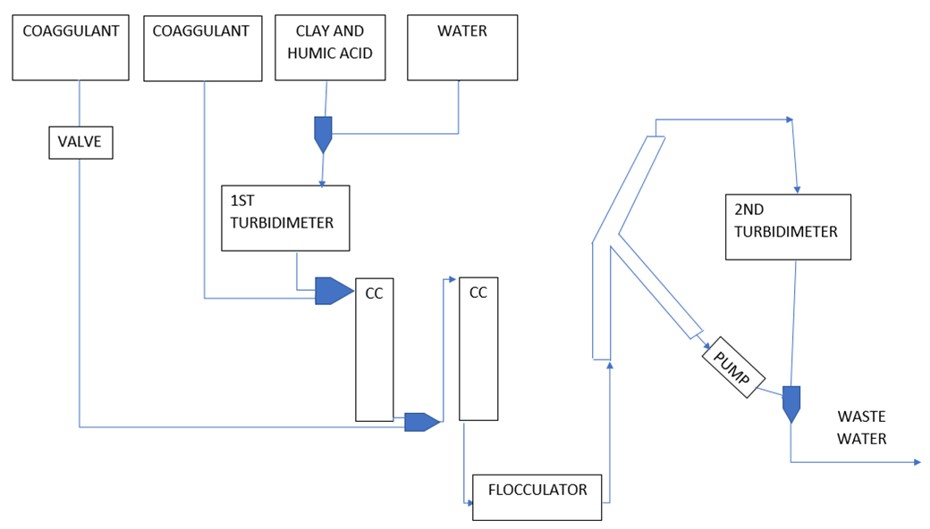

# 2 Stage Coagulant Addition, Spring 2018
#### Barbara Oramah, Ching Pang, Yuhao Du
#### April 21, 2018

## Abstract

Based on the modeling result and bonding mechanism of humic acid, clay and PACl coagulant, we hypothesized that two-stage coagulant addition, namely a separate coagulant addition, would increase the particle removal efficiency. The first addition of coagulant offset the effect of humic acid in water while the second stream of coagulant aggregated clay. Using the same apparatus fabricated from last semester, we conducted experiments for both one- and two-stage coagulant addition. By comparing the particle removal efficiency of different coagulant addition methods, we aim to close the debate of one stage versus two stage.

<div class="alert alert-block alert-danger">
modeling not modelling
PACl not PAC
make "experiment" plural
Good last sentence
Du- addressed

Consider adding in the negative effect of humic acid (that it covers the coagulant, which inhibits clay and other particles from aggregating, which decreases efficiency of flocculation and sedimentaion)
</div>

## Introduction

Flocculation is among the most applied processes for water and wastewater treatment. Therefore, a thorough understanding of the physical and chemical process in flocculation is critical to the optimization of the water treatment process, and so a predictive model to describe the flocculation process is needed. However, the model built by AguaClara only considered the presence of clay and coagulant in water and failed to take natural organic matters (NOM) into consideration. NOMs compose of organic compounds from the remains and waste products of organisms such as plants and animals and are ubiquitous in the natural water system. NOMs can be generated within the water source through biological activities, or introduced to the water body via drainage within watersheds[(Hudson et al., 2007)](https://onlinelibrary.wiley.com/doi/abs/10.1002/rra.1005). The application of flocculation to remove NOM from drinking water supplies is not only efficient, but also helps to avoid the formation of disinfection by products (DBPs).[(Mika et al.,2018)](https://www.sciencedirect.com/science/article/pii/B9780128015032000033) For processes based on the use of chemicals (e.g. coagulation and oxidation), the increasing concentrations of NOM require the use of more chemicals or materials [(Xu et al. , 2016a)](https://www.sciencedirect.com/science/article/pii/S1385894715013406?via%3Dihub). This ultimately leads to the generation of more sludge or spent chemical reagents. Studying the effect of NOM on flocculation is crucial in developing flocculation processes. It can optimize the operating conditions, including coagulant dosage.

<div class="alert alert-block alert-danger">
Revise second sentence - Missing "the" before "water treatment process"
Revise for conciceness i.e. delete "in the past" from sentence three
Remove "are matters" after NOMS
Consider revising the sentence "NOMS can be generated within the water source...breakdown of terrestrial organisms" - Lots of jargon and a different style than most of report
Remove "Hence" from second to last sentence.
Consider "It can optimize operating conditions, including coagulant dosage"

Du: addressed
</div>

The original floc model built by AguaCLara project team only took coagulant and clay into account, it has been extended in this research by including the effect of NOM on flocculation in calculation by applying the revise floc model, created by Du in 2017[(Du,2017)]( ). According to the bonding mechanism between clay, humic acid (HA), and coagulant, we found that smaller particles (e.g. humic acid) move faster than larger particles (e.g. clay) in the fluid. In synthetic water composed by clay, HA and coagulant, HA collides and attaches to coagulant faster than clay. Once the coagulant surface is occupied by HA, its agglomerate performance decreases because the occupied surface cannot attach to clay or nano-aggregate anymore.

<div class="alert alert-block alert-danger">
Revise first sentence for clarity - Also as a point of clarification, when you say that the effect of NOM on flocculation has been taken into account, do you meant that there is already a mathematical relationship about this phenomena done by an outside source? The first sentence implies this.

Put space between words and paratheses i.e. particles (e.g. HA)

Du: addressed
</div>

When using this addition method, coagulants are added to synthetic water stepwise before the fluid enters flocculator. It was assumed that after the first stage of addition completed, all coagulant would be coated by humic acid and offset the effect of humic acid in water. Coagulant added in the second stage function merely as the agglomerant that aggregate clay and nano-aggregate formed in the first stage to create big flocs. Therefore, two-stage coagulant addition is expected to achieve the same particle removal rate with less coagulant when compared with one-stage addition.

<div class="alert alert-block alert-danger">
Consider moving first sentence to the end of the paragraph because the use of "Therefore" means that you have already explained the reasoning prior to that sentence, not after as in this case.

Third and fourth sentences are repetitive.

Keep tenses consistent throughout paragraph

Du: addressed
</div>

If the coagulant dosage can be guided by a predictive model, operating conditions of flocculation process can be optimized, and coagulant can be used more efficiently. AguaClara is an engineering project team focusing on sustainable drinking water supply in communities with limited financial capacbilities, cost is always a main concern. Using less amount of total coagulants by applying a two-stage settings is beneficial as it reduces the operational cost of water treatment plants. [(Liu et. al., 2011)](https://ieeexplore.ieee.org/document/6847925/) With the same total coagulant, when the partial amount added half-way, we found that two-stage coagulant addition can produce flocs 1.5 times the floc size comparing with one-stage. Larger flocs are easier to remove in the sedimentation process. As the floc blanket formed, the flocs were connected to form a larger and more irregular structure, making two-stage addition more time and cost efficient than one-stage.

<div class="alert alert-block alert-danger">
"Since AguaClara is an engineering project team fouses on sustainable drinking water" is a good example of improper verb use. It should be "Since AguaClara is an engineering project team that focuses on sustainable drinking water" or "Since AguaClara is an engineering project team focusing on sustainable drinking water"

Try to avoid phrases like "developing regions" because the Global Health Fellows have told us that those terms are outdated. Consider "communities with limited financial capacbilities"

Du: great suggestion!

Consider revising second to last sentence because it is long and missing a few "the"s i.e. "With the same total coagulant, when THE partial amount was added halfway..."

Revise "As the floc blanket is formed, the flocs are connected together to form a larger and more irregular structure..." - A common error throughout the report is missing words like "a" and "the"

Du: addressed and revised

I think you can delete this last paragraph.

Du: yep, i agree, outline is unnecessary in a research report
</div>

## Literature Review and Previous Work

### Previous Work of AguaClara Project Team
The research of Yingda Du, a previous graduate student on the project team, studied the effects of NOM on flocculation. Her thesis determined the impact of humic acid on the particle size distribution of flocs and settled effluent turbidity of a synthetic surface water treated by polyaluminum chloride (PACl)[(Du, 2017)]( ). The results showed that presence of NOM increased the concentration of flocs and shifted the particle size distribution toward smaller particle sizes with a concurrent increase in the effluent turbidity. A mechanistically based hydraulic flocculation model, which took effects of humic acid into account, was developed in this research based on the observations of residual turbidity. The model was validated by successfully predicting data from independent experiments. The predictive model provided a useful guideline for effective coagulant dosages in water treatment.

<div class="alert alert-block alert-danger">
Put space between words and paratheses

Move in-text citation to the end of the paragraph.

*about the in-text citation*

Du: addressed. , I saw lots of publication did it in the middle of sentences. I think it is just fine to cite literature whenever needed
</div>

Two-stage coagulant addition research was based on the study of bonding mechanisms between different particles in water. There are three different kinds of particles in the research model: clay, humic acid, and coagulant nanoparticle. As shown in Figure 1, there are six kinds of the possible collisions. However, only collisions with coagulant involved can occur in reality, because clay and humic acid are both negatively charged so they will not attach to each other or themselves.

<div class="alert alert-block alert-danger">
Make "mechanism" plural in the first sentence.

Refer to Figure 1 in present tense like "As shown in Figure 1"

Make "collision" plural in sentence three

Revise the last sentence for grammatical errors. Consider "because clay and humic are both negatively charged so they will not attach to each other or themselves." (delete the last phrase "when a collision occurs")

DU: addresed
</div>


    Figure 1： Collisions between particles during flocculation

### Previous Work of Two-Stage Coagulant Addition Subteam
In the Fall 2017 semester, the theoretical basis for future work was built by studying research report of previous particle removal research teams in AguaClara and relevant literature. The 2017 two-stage coagulant addition (2SCA) subteam made the apparatus based on the design of Contact Chamber subteam. Mechanisms related to the contact chambers can be found in the Contact Chamber subteam report[(Contact Chamber)](). The set-up included five pumps to achieve a precise control of fluid flow rate. Two down-flow contact chambers were applied in series before the fluid entered the flocculator. The contact chambers created a space for particle collision to take place. In the apparatus design of 2SCA subteam, the main function contact chambers are providing a place for the collision between different particles, and distinguishing the first stage of coagulant addition from the second. The particle removal rate improvement in the research didn't rely on the coagulant wall loss reduction, which described as the primary function of contact chamber in the Contact Chamber Group's report.

<div class="alert alert-block alert-danger">
Missing "the"s in first sentences

When you discuss the set-up and how it compares to the previous group, is the "previous group" the Fall 2017 team or the team before them. Try to be more explicit with labeling of previous team

When using the word "and" the part before the "and" should mirror the grammar of the part after the "and" - for example "the main function contact chamber is providing a place for the collision between different particles, and distinguish the first stage from the second stage" has two different grammatical set-ups before and after the "and". Consider "the main functions of the contact chambers are providing a place for collisions to occur and distinguishing the first stage from the second."

Revise this paragraph for incomplete/choppy sentences. Additionally revise the second the last sentence for clarity and understanding. State more explicitly that the contact chamber can also be use for reducing coagulant loss on the walls of the flocculator, but that this is not their main purpose here.

Remove last sentence.


Address the bolded statement at the top and remember to delete it before the final submission.
- I recommend moving this info down to be with the aparatus info in Methods.

Du: all addressed
</div>

**ADD some background for floc blanket**

A floc blanket is a fluidized bed of flocs that are maintained in the bottom of an up-flow sedimentation tank. The highly concentrated suspension acts like the second flocculator that intercepts incoming clay particles. [(Weber-Shirk, 2009)](http://cuaguaclara.blogspot.com/2012/08/the-floc-blanket-quest.html) Floc blanket can help reduce the turbidity of the settled water, and improve the particle removal performance dramatically. One of AguaClara's goal was to add floc blanket in the plant. The purpose of the research was to observe the floc blanket formation in every trial.

<div class="alert alert-block alert-danger">
Revise this for floor and complete sentences.
Du: addressed
Also this does not have a great lead in or connection to the previous paragraphs.
Du: in processing
</div>

### Literature Review

Flocculation reduces the repulsive potential of electrical double layer of colloid by using coagulants. As a result, colloidal microparticles develop and then agglomerate into larger flocs. **(The mechanisms of agglomeration phenomenon are various, including the coagulant's metal ions into insoluble aggregates)**[(Henderson et al., 2006)](https://www.scopus.com/record/display.uri?eid=2-s2.0-33744489650&origin=inward&txGid=aaab348399699d2ac6549079332441da).

<div class="alert alert-block alert-danger">
This is very jargon filled and would be difficult for a new member of AguaClara to understand.

Remember to address and remove bolded words before final submission.
</div>

The optimum operating conditions to remove turbidity by flocculation, such as pH and coagulant dosages, are not necessarily the same for NOM removal.[(Yan et al., 2008)](https://www.sciencedirect.com/science/article/pii/S1383586609002342?via%3Dihub) The treatment process for water containing different concentrations of NOM vary. Considering the high variability of NOM's organic components in different water sources, the removal mechanisms will substantially differ from one water source to the other or within the same source due to seasonal variations. The result will be a variable removal efficiency of coagulation and the formation of flocs with different sizes and structures[(Jarvis et al., 2006)](https://www.sciencedirect.com/science/article/pii/S0043135406002405?via%3Dihub).

<div class="alert alert-block alert-danger">
Revise "Thus the treatment processes for water contains the different concentration of NOM are varied." Consider "The treatment process for water containing different concentrations of NOM vary."

Intext citations should go before the period at the end of a sentence. Fix this throughout the report.

Du: The explaination about intext citation can be found in earlier comment

Consider removing or rephrasing "Which urges the development of various water treatment strategies in different contexts" because it is vague and doesn't add substantial value to the sentence.

Du: addressed
</div>

**in process** The presence of NOM in water has notable effects in the dispersion of clay particles. The effect can be seen when using the particle-size distribution calculations on water with NOM present. [(PSD calculation)](https://www.innopharmalabs.com/tech/applications-and-processes/particle-size-distribution) A frequency increase in the nanoaggregate in comparison to a mixture with clay alone can be seen. However, the surface of humic acid is significantly more negative, thus creates repulsive forces between the particles, and increases the number of dispersed particles.[(Kretzschmar et. al)](https://dl.sciencesocieties.org/publications/sssaj/abstracts/61/1/SS0610010101) A direct relationship also exists between the decrease in pH and increase in sorption of humic acid.

<div class="alert alert-block alert-danger">
This section seems to be repeating Yinga Du's conclusions. It may be better to trim this section down since it has already been partially discussed before.

What is nanoaggregate in this context?

Revise "However, the surface of humic acid is significantly more negative, thus creates" for proper verb use.
</div>

Coagulants usually function as neutralizer and destabilizer in the particle removal process. Regarding NOM, the flocculation-based removal process is more efficient when more positively charged aluminum species are generated because NOM is mainly composed of organic compounds with negatively-charged functional groups. As shown in Figure 2, the negatively charged solids particles repel each other initially. However, as positively-charged coagulants are added to the mixture, they adhere to the negatively charged colloids, and neutralize the charge and destabilizing the particles. With the removal of charge, the destabilized colloids can now adhere to each other, forming microflocs.

<div class="alert alert-block alert-danger">
Very clear paragraph here. I previous sections, the charged of the particles are discussed so I recommend minimizing the discussion in those sections because this paragraph does a good job explaining the main ideas.

DU: removed one previous sentence discussing particle charge, remained ones were kept cuz I think they were helpful in completing the logic
</div>


    Figure 2： Coagulants function as neutralizer and destabilizer

PACl is used commonly in research because of its compatibility  with a majority of NOMs, low sensitivity to temperature and low residual metal-ion concentration. PACl is significantly more efficient than other chemicals in HA removal. [(Sudoh et. al., 2015)](https://www.sciencedirect.com/science/article/pii/S2213343715000871) Projects prefer using PAC also because of its low cost and high availability in both solid and liquid form. [(Bratby,2006)](https://www.sciencedirect.com/science/refhub/S0045-6535(17)31538-2/sref15)


<div class="alert alert-block alert-danger">
Revise first sentence for conciseness - consider "PACl is used commonly in research because of its compatibility..."

Remember to use PACl not PAC.

Consider "PACl is significantly more efficient than other chemicals" - the current sentence is wordy and indirect

Revise the last sentence: "PACl is also less expensive than other chemicals and more widely available."

DU: i kept the last half of the sentence because high availability in solid and liquid form is a useful fact about PACl
</div>


## Methods

### Experiment Process

#### Materials

* **Humic acid** -  the representative NOM. It is the most commonly found  NOM in the natural system.
* **Kaolin clay** - represents the colloidal solids.
* **Polyaluminium chloride (PAC)** - the coagulant.

#### Variables

##### Control Variables
**in process**
* **Influent Turbidity** - the influent turbidity value 2SCA team evaluated was 100 NTU.
* **Coagulant Dosages** - the increment function used in ProCoDA increased the coagulant dosages stepwise. When the run time of current state reaches the duration set in ProCoDA, the function will be activated and increase the coagulant pump speed according to the setting. Details about ProCoDA set-up can be found after the main text.

<div class="alert alert-block alert-danger">
Double check that the acronym TSCA was defined earlier in the report.

Either use first or third person. In the abstract you use "we, I" and here you use "TSCA team" - Please pick one or the other and use it consistently.

Incorrect verb use in description of Coagulant Dosages and lacking "the"s
</div>

##### Independent Variables
* **Concentration of Humic Acid**
* **Concentration of Kaolin Clay**

##### Dependent Variables
* **Effluent Turbidity** - the effluent turbidity showed the efficiency of particle removal in the system.

Throughout the semester, a series of one-stage coagulant addition experiments were carried out to find the optimal coagulant dosage that could reduce the effluent turbidity to 3 NTU or less which is the desired turbidity for filtration. During one-stage experiments, the second coagulant pump was turned off so that only one stream of coagulant added.

<div class="alert alert-block alert-danger">
Change "effluent turbidity of 3 NTU or less, the required turbidity" to "effluent turbidity to 3 NTU or less which is the desired turbidity for filtration"

Du: addressed
</div>

In two-stage coagulant addition experiments, total coagulant dosgae used in one-stage addition experiments were divided into two parts by adding one more stream of coagulant between the first and second contact chamber. The goal of the two-stage experiments were finding the optimal distribution between the first and second stream coagulant. The desirable situation was that most of the coagulant from the first addition would offset the effect humic acid in the water, and coagulant from the second addition would be able to attach to clay and nanoaggregate, thus forming big flocs and reducing the effluent turbidity efficiently.

The T connection is an essential part for two-stage coagulant addition. As shown in Figure 3, it was installed between the two coagulant pumps to help allocate the coagulant among first and second stage. The first pump controlled the total amount of coagulant drained from the stock tank. Coagulant flowed through the left branch to the right branch after came out of the stock tank. When the second coagulant pump turned on, it controlled the coagulant amount put in the second stage by draining from the main stream, then coagulant flowed in through the left branch and was separated into two streams by the top and right branch.

<div class="alert alert-block alert-danger">
Consider describing the T connection as an essential part rather than set-up

Divide the first sentence into two (run-on)

Du: addressed
</div>


    Figure 3：T-connection used in two-stage experiment to separate the two streams of coagulant.


### Experimental Apparatus Design
**in process**

ProCoDA (Process Control and Data Acquisition) software was used to automate data collection and control the experimental apparatus. Two up-flow contact chambers set before the fluid entered the flocculator, so that the coagulants had more time and space to collide with the particles in water. During the first stage, in the first contact chamber, coagulants collided and covered by humic acid. Ideally, two pumps s placed before each contact chamber to achieve the two-stage coagulant addition. However, due to the limit port numbers in the system, we could only control two pumps at the same time, and one of them has to be the clay pump.

<div class="alert alert-block alert-danger">
Revise paragraph looking for places where words like "by", "the", and "a" are either missing or used incorrectly. Also look for incorrect verb tenses. Make sure that every sentence is a full complete sentence. Pay particular attention to sentences 2, 3, and 5
</div>

The apparatus developed last semester was used this semester and can be seen in Figure 4 and 5. The contact chamber was reversed from down-flow to up-flow so that all the air stucked in the system can be ejected. Our apparatus set-up reflected the properties of the AguaClara water treatment plant. The sedimentation tube in our system had the fundamental structures of sedimentation tank in the AguaClara water treatment plant, including the floc weir, floc settler, floc blanket and sludge valve. Further detail about the design of sedimentation tube can refer to the research of High Rate Sedimentation group in AguaClara[(HRS report)]( ). A tube flocculator was used in this research because it was idealized as a high-Péclet-number reactor, much like a baffled hydraulic flocculator, also because the average velocity gradient in laminar tube flow was well defined [(Weber-Shirk and Lion 2010)](https://www.sciencedirect.com/science/article/pii/S0043135410004136). An electronic balance connected to ProCoDA had been implemented to track the mass change in the coagulant stock tank. The balance can verify the amount of coagulant entered the system and send data collected by ProCoDA.


<div class="alert alert-block alert-danger">
Revise first sentence - Consider "The apparatus developed last semester was used this semester and can be seen in Figure 4 and 5."

Focus on refining the middle section for conciseness.
</div>




    Figure 4：Apparatus diagram


    Figure 5: Current Apparatus Set-up

Handling the operation of ProCoDA software was another critical task the subteam accomplished in Fall 2017 semester. ProCoDA is a process control software that allows the user to control many parts of the experimental apparatus and collect data automatically. ProCoDA can control the speed of peristaltic pumps, regulate flow through solenoid valves, and measure water quality parameters such as turbidity by connecting to the turbidimeter. Automated data acquisition can record the speed of pumps, the turbidity of water, the mass of container to an Excel spreadsheet directly. The experiment outcomes are processed with Excel and Python codes. Increment function is a command built in ProCoDA, and it can adjust experimental parameters automatically according to the setting over time. By applying the increment function, the team can conduct series of control experiments without staying in the lab. Python codes were created to calculate coagulant dosage, the composition of clay-HA mixture, and pump speed, the code was attached to the main text.

ProCoDA can only control a maximum of two pumps due to the limit port. The clay pump must be connected to the computer to achieve closed-loop control, and one of the coagulant pumps had to be controlled by ProCoDA to apply increment function. Therefore, the humic acid and clay mixture must be controlled manually. In the experiment, clay, HA, and water were added, according to the calculated amount, into a 10 L stock tank with a stirrer. The calculated amounts can be determined from the Python code later in the report. This stock tank was connected to the clay pump. The clay pump speed was controlled by ProCoDA to maintain a relatively fixed influent turbidity. After that, a mixture of humic acid and clay went through the first turbidimeter, and influent turbidity of the raw water was measured. Subsequently, the first stream of coagulant was added right before the fluid entered the first contact chamber. However, for a two-stage coagulant addition experiment, the second stream of coagulant was pumped into the system after the first contact chamber.

<div class="alert alert-block alert-danger">
Consider "ProCoDA can only control a msximum of two pumps due to a limited number of ports int he ProCoDA box."
</div>

Table 1: Parameters and resulting values of the current design.

| Parameter | Meaning | Value |
| ----- | ------------------------ | ----- |
| V.Sed | Sed Tank Upflow Velocity | 1-2 mm/s |
| D.Sed | Sed Tank Inner Diameter  | 1 in  |
|Q.Sed, Q.Reactor| Flow rate (from V.Sed) |1.52 mL/s|
|D.Floctube|Floctube Inner Diameter| 0.17 in |
| Gtheta | G*theta | 20,000 |

### Experiment Operation
The goal of the flocculation and sedimentation system was reducing the water turbidity to 3 NTU or less to meet the requirement of AguaClara filtration system. The filter did not work well when treating water with turbidity higher than 3NTU. In our research, first, we need to find the coagulant dosage that can reduce the turbidity to 3NTU, then compare the particle removal efficiency of one-stage and two-stage addition with that amount of coagulant.

For one-stage addition experiments, the coagulant dosages ranged from 2.0 to 4.0 mg/L.  The target influent turbidity was kept at 100 NTU by ProCoDA. 100NTU was much higher than the turbidity of natural water, high turbidity was used to test the performance of apparatus under extreme condition. Currently, the humic acid concentration was constant throughout each trial, and the value was 0.2mg/L. By applying different humic acid concentration while kept the coagulant dosage, the effect of humic acid on flocculation process can be tested. The desirable effluent turbidity  (Fig. 6) usually observed when using 1.5 mg/L of coagulant or more, and coagulant concentration less than 1mg/L was proved to be insufficient to reduce the turbidity in previous experiments. The two-stage coagulant addition experiment based on the data generated in one stage addition experiment. The total coagulant dosage used for the two-stage addition was the optimal amount found in the one-stage experiments.

<div class="alert alert-block alert-danger">
Revise for incorrect use of plural/singular (i.e. using concentration instead of concentrations), missing "the"s and "a"s, and run-on/wordy sentences. **this note goes for the following two paragraphs**

DU: addressed
</div>

At the beginning of the semester, HA concentration used in the experiments was 0.8mg/L, but there was no floc blanket formation in most of the trials. The HA concentration then decreased to 0.2mg/L to guarantee the formation of floc blanket. We used pure clay suspension in some of the experiments to compare with the experiment outcome when using HA and clay suspension. The effect of HA on the interparticle distance of clay was studied.  A series of two-stage addition experiments were conducted to find the most effective ratio of coagulant allocation between the first and second stage.

The pumps ran with higher actual RPM than the value displayed on its screen when operating around the minimum speed. According to the past experiments, pump speed lower than 12 RPMshould be avoided. The increment function determined the lowest pump speed applied in the experiment, the intercept of the function defined the lowest coagulant pump speed. For later operations, a higher intercept for the increment function was set so that the lowest pump speed was 20 RPM.

## Results and Analysis
### Analysis of Undesirable Research Outcome

<div class="alert alert-block alert-danger">
Consider a different heading that described the undesirable research outcome
</div>

Experiment data of one stage addition experiments did not align with the expectation initially. We expected to find the floc blanket in the sedimentation tank because the minimum coagulant dosage in the experiments was 1.5 mg/L, enough to reduce the effluent turbidity to 15 NTU or less according to past research. The formation of floc blanket was critical to the data analysis as experiment data with and without the formation of floc blanket can not compare with each other.

One possible explanation for the absence of floc blanket was due to the limit time of data acquisition state (detailed explanation of ProCoDA set points can be found after the main text), the system did not have enough time to form the floc blanket. Therefore, the duration of data acquisition state was extended, from 3600 seconds to 4800 seconds, and to 6000 seconds finally. Based on our observation, dense floc blanket as shown in Figure 6 was formed one hour after the coagulant was added. We found that if no floc blanket formed within two hours, it would not form later.


    Figure 6: Floc blanket in the sedimentation tube

The experiment data of one stage addition also did not exactly aligned with the floc model. By using the same HA concentration and coagulant dosage, the effluent turbiditiy was higher than the model result. After studying the experiment settings of past research and other subteams, our research was found to be the only one premixed the clay and HA to create the synthetic water, it was possible that the mechanism of particle distance and surface charge had impacted the results.


    Figure 7: Floc Model result at 100NTU

<div class="alert alert-block alert-danger">
The content and logical progression and organization of the report has gotten significantly better and much easier to follow. I have made many notes up to this point on common writing errors that propogate throughout, so from this comment forward, I will only point on limited, significant grammatical errors but encourage you to revise the rest of the report similarly to the first portion that I commented extensively.
</div>

### Impact of surface charge
Due to the limited number of ProCoDA box ports, our group had to premix the clay and humic acid before pumping them into the contact chamber. The premix could lead to two possible outcomes. First, if clay particles covered by humic acid when stirred in the stock tank, the suspension should be easier to remove than usual, because some of the HA attached to clay and the number of HA particles decreased. However, according to our observation, suspension made with clay and humic acid was harder to remove than pure clay suspension. Therefore, a second hypothesis was raised. As both clay and humic acid are negatively charged, due the prior mixing, the charge density of clay particles increased after attached by humic acid, the clay particles then became more repulsive to each other. Thus, the clay particles were more dispersed, and the surface area of clay was increased, the suspension became harder to be removed by flocculation. In reality, suspension with humic acid did require more coagulant than a suspension with only clay.

<div class="alert alert-block alert-danger">
Avoid the term "limit port", describe the limitation, as the limited number of ProCoDA box ports.
</div>

Data generated with different humic acid concentration was compared in Figure 8. As shown, when there was humic acid in the suspension, the effluent turbidity decreased with a slower rate than normal, meaning the floc blanket formed more slowly. The lowest effluent turbidity was higher than suspension without HA. These observations suggested that the premixing of HA and clay made the suspension harder to remove. 


    Figure 8: Experiment outcome with and without humic acid


Table 2:  Experimental Parameter for Figure 8

| Parameter | Value |
| --------- | ----- |
| Coagulant Dosage|2.4mg/L-2.7mg/L |
| Humic Acid Concentration | 0mg/L and 2mg/L |
| Target Influent Turbidity|  100NTU  |
| Up Flow Velocity| 2mm/s|

### Impact of coagulant dosage
Regarding the effect of coagulants dosage, determining the optimal amount was crucial because overdosing the coagulant could result in a substantial increase in the amount of generated sludge and a decrease in pH, while a lower dose could be the cause for the residual metal remaining in treated water[(Ibrahim and Aziz, 2014)](http://www.ijsrpub.com/uploads/papers/IJSRES/IJSRES-2014/Mar/IJSRES-13-111.pdf). Increasing the PACl dose had been shown to increase NOM removal up to a certain point. However, NOM removal was not significantly improved with very high alum dosages, which suggested that some components of NOM were recalcitrant to being removed by coagulant.

<div class="alert alert-block alert-danger">
Is this a result from your experiments? If not move it to the lit review.
</div>

Under the control of increment function, coagulant dosage was increased over time. Figure 9 shows the experimental data of one stage addition trial, which could be used to study the effect of coagulant dosage on floc formation. The influent turbidity was 100NTU, and the effluent turbidity reached the peak during the flush state, when floc blanket was washed out. Then, it was reduced steadily after the system switched back to data acquisition state, the floc blanket formed after coagulant entered the system (detail explanation can be found after the main text). As shown in Figure 9, with the stepwise increase of coagulant dosage, the effluent turbidity dropped faster with a steeper slope. This suggested that the floc blanket formed faster with higher coagulant dosage, which aligned with the observation.


    Figure 9: Experiment result with different coagulant dosage

<div class="alert alert-block alert-danger">
Can't see figure 9
</div>

Table 3: Experimental Parameter for Figure 9

<div class="alert alert-block alert-danger">
Change to "Experimetal Parameters"
</div>

| Parameter | Value |
| --------- | ----- |
| Coagulant Dosage|1.5mg/L-2.8mg/L |
| Humic Acid Concentration | 8mg/L |
| Target Influent Turbidity|  100NTU  |
| Up Flow Velocity| 2mm/s|

## Conclusions

A set of control experiments with fixed turbidity and different coagulant dosage was carried out with the increment function of ProCoDA. In general, with the current design of system, when the turbidity was relatively low, the particle removal efficiency . The target effluent turbidity of this experiment was no more than 3 NTU, in order to comply with the standard AguaClara system. Our minimum turbidity is now around 6 NTU, as we used a low coagulant dose and our method of manufacturing synthetic wastewater is different from other research groups. The effect of premixing makes our turbidity more difficult to remove."

<div class="alert alert-block alert-danger">
Revise the second sentence because I don't understand what it is trying to say.
</div>

It was found that two-stage coagulant addition needed more time than one stage addition to form floc blanket. However, in trials with relatively low turbidity, the formation of floc blanket was not seen under the same condition when comparing one-stage and two-stage. No significant difference was observed in terms of the lowest turbidity between one stage and two stage addition experiment under the same parameters.

In the rest semester, both one stage and two stage experiments would be continued. If the hypothesis of 2-stage hypothesis was validated, a model could be created to guide the amount of coagulant dosage in water treatment plant, and potentially lessen the coagulant used, which could cut down the operational cost.

<div class="alert alert-block alert-danger">
Update this last paragraph at the end of research this semester.
</div>

## Future Work
The current design of contact chamber is shown deficient by the contact chamber group because the two up-flow contact chambers applied could not function as what they were designed to be. Experiments demonstrated that the current design could not successfully reduce the wall loss of the coagulant or improve the particle removal efficiency. **/Du: I think this part can be kept in current section, it only reports some small findings by other group. It's the incentive of improving the design of CC**

Although currently the contact chamber only acted as a place for particle collision, and for defining the first and second stage addition physically, modifying the design of contact chamber in the future could potentially increase particle removal efficiency. Currently, AguaClara uses a tube contact chamber, which can be easily fabricated by cutting a PVC tube. Without changing the general design, the effect of contact chamber with different length and diameter can be studied.

<div class="alert alert-block alert-danger">
Revise discussion about contact chamber to be concise and direct. I understand now it's purpose and agree it should stay, but try to streamline it. Also do you think the inversion of the contact chamber affected your results this semester?
</div>

The effect of pH has not been considered in the current research. However, pH could be the single most crucial factor affecting the effectiveness of metal-based coagulants[(Qin et al., 2006)](https://www.sciencedirect.com/science/article/pii/S1383586605003187?via%3Dihub). In the future, pH can be measured during the experiment by both pH meter and pH test paper. In either water treatment plant or apparatus in the lab, pH can be adjusted by applying different chemical reagent, and varying pH will allow us to see the effect of pH. On the other hand, experimental process can simulate the environment of water treatment plant if the pH value align with the water is kept constant in the plant.


The predictive floc model developed by AguaClara is based on the past apparatus set-up and experiment process. Without considering the presence of floc blanket and the use of new tube sedimentation tank, the model cannot simulate the current experiment, and its modeling result deviates significantly from present experimental data. The ultimate goal is to revise the model to align it with the experiment in the lab well so that the up-to-date research findings provide a guide for AguaClara water treatment plant.

The predictive floc model developed by AguaClara is based on the past apparatus set-up and experiment process. Without considering the presence of floc blanket and the use of new tube sedimentation tank, the model can not simulate the current experiment, and it modeling result deviates a lot from present experimental data. The ultimate goal of our group is to revise the model to make it well aligned with the experiment in the lab so that the up-to-date research findings can guide AguaClara water treatment plant.


The research on two-stage coagulant addition should continue in the future. According to our study, the two-stage addition was proved to perform better than one-stage addition in some circumstance. Two-stage addition can achieve higher particle removal rate than one-stage while using the same amount of coagulant. Future research group should test the performance of two-stage addition in a condition closer to the real world to guide the application of this technology in AguaClara water treatment plants.

<div class="alert alert-block alert-danger">
Which of these future task do you think is the priority for next semester? Try to discuss the three ideas in order from most important to work on to least important for right now!
</div>

## Bibliography
Du, Yingda. 2017. “Observations and a Geometric Explanation of the Effects of Humic Acid on Flocculation.” Cornell University.

Henderson, R., Sharp, E., Jarvis, P., Parsons, S., Jefferson, B., 2006. Identifying the linkage between particle characteristics and understanding coagulation per- formance. Water Sci. Technol. Water supply 6, 31e38.

Hudson, N., Baker, A., Reynolds, D., 2007. Fluorescence analysis of dissolved organic matter in natural, waste and polluted waters - a review. River Res. Appl. 23, 631e649.

Knauer, K., Homazava, N., Junghans, M., Werner, I., 2017. The influence of particles on bioavailability and toxicity of pesticides in surface water. Integr. Environ. Assess. Manage. 13, 585e600.

Kretzschmar, R. , Sticher, S., Hesterberg, D., 1997 Effects of Adsorbed Humic Acid on Surface Charge and Flocculation of Kaolinite

Jarvis, P., Jefferson, B., Parsons, S.A., 2006. Floc structural characteristics using conventional coagulation for a high doc, low alkalinity surface water source. Water Res. 40, 2727e2737.

Liu, Ting et al. 2011. “Effect of Two-Stage Coagulant Addition on Coagulation-Ultrafiltration Process for Treatment of Humic-Rich Water.” Water Research 45(14): 4260–68.

Logan, B. E., Hermanowicz, S. W., & Parker,A. S. (1987). A Fundamental Model for Trickling Filter Process Design. Journal (Water Pollution Control Federation), 59(12), 1029–1042.

Qin, J.J., Oo, M.H., Kekre, K.A., Knops, F., Miller, P., 2006. Impact of coagulation pH on enhanced removal of natural organic matter in treatment of reservoir water. Sep. Purif. Technol. 49, 295e298.

Sillanpää, M., Matilainen, A., (2015). Natural Organic Matter in Water: Characterization and Treatment Methods, 55-74.

Sudoh, Ryou et al. 2015. “Removal of Dissolved Humic Acid from Water by Coagulation Method Using Polyaluminum Chloride (PAC) with Calcium Carbonate as Neutralizer and Coagulant Aid.” Journal of Environmental Chemical Engineering 3(2): 770–74.

Weber-Shirk, M. L., and Lion, L. W. (2010). “Flocculation model and col- lision potential for reactors with flows characterized by high peclet numbers.” Water Res., 44(18), 5180–5187.

Xu, Y., Chen, T., Liu, Z., Zhu, S., Cui, F., Shi, W., 2016. The impact of recycling alum- humic-floc (AHF) on the removal of natural organic materials (NOM): behavior of coagulation and adsorption. Chem. Eng. J. 284, 1049e1057.


Wang, D., Ni, J., Qu, J., Ni, W., Van Leeuwen, J., 2009. Natural organic matter (NOM) removal in a typical North-China water plant by enhanced coagulation: targets and techniques. Sep. Purif. Technol. 68, 320e327.

# Experiment Manual

## Fabrication Details
Most of the fabiracation of bench area apparatus was completed in last semester, the connection between different part is described in the experiment apparatus part. The fabrication of contact chamber can refered to the report of contact chamber group.[Contact Chamber]()


## Experimental Methods

### Experiment
**Step 1.** Fill stock tanks. One stock tank should be filled with a diluted solution of PAC coagulant, and the other should have a mixture of water, clay, and humic acid. The concentration of solution depends on experiment objectives and can be calculated by using the chemical dosage calculation code below.

**Step 2.** Once the solution is prepared, open the water and wastewater valves, turn on turbidimeters, and let the apparatus completely filled with water, the experiment is now ready to run. Be sure to turn on the sludge pump, a 1L/s pump next to the effluent turbidimeter, to ensure that sludge is drained to the wastewater line.


**Step 3.** Check important set points in ProCoDA. Set target influent turbidity, duration of data acquisition state and flushing state.

**Step 4.** Open the ProCoDA software and turn the "operation state" from OFF to ON, to turn on the clay pump so the influent turbidimeter will soon reach the target influent turbidity. Once the influent turbidity fluctuates around the target influent turbidity, go back to ProCoDA and switch the state from "ON" to "Data acquisition state", the coagulant pump will be turned on. Then switch the operational mode from "Manual" to "Auto Switch".

**Step 5.** The data acquisition state will go back and forth with the flush state, which is used to wash out the floc blanket. The data will be recorded on a spreadsheet for further use.


**Step 6.** Once the data collected, check the catalog and turn off ProCoDA. Proceed to the cleaning procedure when experimentation is finished.

### Cleaning Procedure
 Once the experiment is done, we want to completely wash out the apparatus so it will be ready for the next experiment.

 **Step 1.** Turn off the clay and coagulant pumps while running the water pump with a relatively high speed, normally over 120rpm.


 **Step 2.** Remove entire apparatus from the wall (recirculator \& tube settler) and thoroughly wash it out, then reattach it back to the wall.

 **Step 3.** Wash out the flocculator by unplugging the connection between the outflow tube from the influent turbidimeter and the flocculator, and plug-in tubing from the nearby sink to wash out the flocculator. Make sure there is a bucket at the end of the flocculator that will collect the water.

 **Step 4.** Clean the influent and effluent turbidimeter. Make sure to turn on the Bypass channel first! First, open the bypass valve. Second, pinch the black outflow tube.

 **Step 5.** Remove and wash out the vials from both turbidimeters. Refill the vials with clean water, then put back into the turbidimeters. Use Kimtech wipes to clean the glass thoroughly.

 **Step 6.** Turn off water to the flocculator and detach the tubing. Hook up the influent turbidimeter back into flocculator then re-open the influent turbidimeter but keep the effluent turbidimeter closed. Turn on the water pump to clean out the influent turbidimeter as well as the flocculator.

 **Step 7.** Pour out the coagulant reservoir into a different bucket and rinse reservoir with deionized water to make sure all residue is washed out. Take out the push pin then wash out the coagulant reservoir thoroughly. Replenish reservoir with 5L (or less) of deionized water. Use Python calculation codes to determine how much 70.9mg/L PACl coagulant needed to use to get the desired results of the experiment.

## Experimental Checklist
Before running the experiment, check apparatus with following steps:

**Step 1.** Turn on the influent and effluent turbidimeter and check whether the inside glass container is clean.

**Step 2.** Before reassembling the turbidimeter again, we let only the tap water run through the system to see if there is any leak, especially near the turbidimeter, in case water would flow to the interior of the meter and cause damage to the apparatus.

**Step 3.** Turn on all pumps and set them with a tiny RPM value, then check if pumps run in the right direction.

**Step 4.** Go to the "edit rules" part of the ProCoDA, check the slope and intercept value of the increment function, make sure to set those values according to the calculation.


**Step 5.** The last step, turn to "operation" part of ProCoDA, switch the state to "Data Acquisition" and make sure states would switch between one another automatically.

## ProCoDA Method File

### States

**{OFF}** - Resting state of ProCoDA. All sensors, relays, and pumps are turned off.

**{ON}** - ON state of ProCoDA. All sensors, relays, and pumps are turned on.

**{Data Acquisition}** - State where the coagulant pumps work and the increment function would increase its value each time when system switches to this state. The duration of this state usually set to be 2 hours, which is enough for the floc blanket to form.


**{Flush}** - State where the coagulant pumps stop working, during this stage raw water would run through the system and flush out the floc blanket build in last data acquisition state so that every data acquisition state would run with same original system condition.


### Set Points

**{Turb target}** - The value of our target influent turbidity, ProCoDA will control the clay pump to maintain the target influent turbidity.

**{pump control(clay)}** - Use this set point to decide which pump should we control.

**{Flush Time}** - Duration of the flush state.

**{Data Acquisition Time}** - Duration of the data acquisition state.

**{State to Increment}** - Tells the increment function when to increase its value, in this experiment, increment function controlled coagulant pump speed.

**{Slope}** - The slope of increment function.

**{Intercept}** - The intercept of increment function.

**{Max x}** - Times the increment function will work during one circulation.


**{coagulant pump control}** - Points out which coagulant pump should we control.


**{coagulant pump property}** - Flow rate per revolution.

**{balance}** - Variable with the value returned by the electrical balance.

 ## Python Code

 ### Variables
 $g$: gravity
 $\sigma$: dispersion
 $a$: amplitude
 $h$: water depth
 $H$: distance from wave crest to trough (2$a$)
 $T$: wave period
 $\lambda$: wavelength
 $k$: wavenumber
 $c_p$: celerity (wave phase speed)
 $P$: pressure
 $F$: force
 $u$, $w$: x-velocity, z-velocity components

### Chemical dosage and pump speed calculation
 ```python
 # build the environment
import numpy as np
import pandas as pd
import matplotlib.pyplot as plt
from aide_design import physchem as pc
from aide_design.units import unit_registry as u
from aide_design import utility as ut

# calculate the flow rate of the system and water pump speed
V_sedimentation_upflow = 1*(u.mm/u.s)
InnerDiam_SedTube = 0.96*u.inch
Area_SedTube = 0.25*np.pi*(ID_pipe**2)
Q_system = V_sedimentation_upflow*Area_SedTube

print('The flow rate of the system is', (ut.sig(Q_system.to(u.mL/u.s),3)))

WaterPumpQperRev = ((52*u.ml/(20*u.rpm)))/(0.5*u.min)
WaterPumpSpeed_perSecond = (Q_system/WaterPumpQperRev)*(60*u.s)

print("The water pump speed is ",WaterPumpSpeed_perSecond.to(u.dimensionless))

# Calculate the mass flow of coagulant
# desired conc of PAC per L of water in the system. (0.5-2.5mg/L)(normally fixed range)

conc_PACL = 1.5 * (u.mg/u.L)

MassFlow_coag = conc_PACL*Q_system

print('The mass flow of coagulant in the system is',ut.sig(MassFlow_coag.to(u.mg/u.s),3))

# how many mL of lab concentration are added per L into the reservoir(adjustable)
k_dilution = 3.80*(u.ml/u.l)

# concentration in grams per L of lab solution(normally fixed value)
conc_labsolution = 70.9*(u.g/u.L)
conc_tank = conc_labsolution*k_dilution
Q_coagtank = MassFlow_coag/conc_tank
V_coagtank = 2*u.L
V_lab_solution = V_coagtank*conc_tank/conc_labsolution
print('The volume of lab concentration solution we need to add into the tank is',ut.sig(V_lab_solution,3))

# calculate the relevant pump speed, so that we can set our increment function

# The flow pumped out of the pump per round(measured by experiment)

Q_perrev_coag1 = 0.003979*(u.ml)
Q_perrev_coag2 = 0.02604*(u.ml)
#Q_perrev_coag1 = 0.0173*(u.ml/u.s)
# Q_perrev_coag2 = 0.103*(u.ml/u.s)
numRPM_coag1 = Q_coagtank/Q_perrev_coag1*(60*u.s)
numRPM_coag2 = Q_coagtank/Q_perrev_coag2*(60*u.s)
print('The pump should run with a speed of',numRPM_coag1.to(u.dimensionless))
print('The pump should run with a speed of',numRPM_coag2.to(u.dimensionless))

# concentration of the clay
turbidity_target = (100*u.NTU)
print(ut.sig(turbidity_target.to(u.g/u.L),3))

# concentration of the humic acid
conc_HA = 8*(u.mg/u.L)
print(conc_HA.to(u.g/u.L))

# clay&HA in tank
# the concentration of the solution in stock tank is K times concentrated than system requirement
V_mixture = 5*u.L
K_condense = 20
clay_add = turbidity_target*K_condense*V_mixture
HA_add = conc_HA*K_condense*V_mixture

print("so we add",clay_add.to(u.g),"clay and ",HA_add.to(u.g),"humic acid into the system.")
 ```

# Floc model

```python
import numpy as np
import pandas as pd
from matplotlib import pyplot as plt

from aide_design import floc_model as floc

from aide_design.units import unit_registry as u

import sys, os
GitPath = os.path.join('~', 'Documents', 'GitHub')
myGitHubdir=os.path.expanduser(GitPath)
sys.path.append(myGitHubdir)


k = 0.24
coag = np.array([0.53, 1.06, 1.59, 2.11, 2.56]) * u.mg/u.L
conc_humic_acid = np.array([0, 3, 6, 9, 12, 15] * u.mg/u.L)
# dataset[0] is the 50NTU, dataset[1] is the 100NTU.
# Within both subgroups, [0] is the pC.0, ranging evenly up to [5] which is the
# pC.15
dataset = np.array([[  # Dataset[0]: the 50NTU datasets
                     [0.634, 0.729, 0.891, 1.062, 1.205],
                     [0.563, 0.717, 0.903, 1.038, 1.193],
                     [0.136, 0.513, 0.793, 1.027, 1.095],
                     [0.109, 0.264, 0.749, 1.002, 1.089],
                     [0.084, 0.128, 0.647, 0.962, 1.057],
                     [0.061, 0.094, 0.308, 0.717, 0.928]
                     ],
                    [  # Dataset[1]: the 100NTU datasets
                     [0.746, 0.953, 1.191, 1.295, 1.414],
                     [0.563, 0.835, 1.085, 1.255, 1.403],
                     [0.185, 0.692, 0.971, 1.254, 1.390],
                     [0.105, 0.280, 0.956, 1.238, 1.361],
                     [0.097, 0.207, 0.740, 1.209, 1.316],
                     [0.084, 0.157, 0.566, 1.084, 1.314]
                     ]
                    ])
indexnames = ['{0} mg/L'.format(i) for i in np.arange(0,16,3)]
Data50NTU = pd.DataFrame(dataset[0], index=indexnames).T

Data100NTU = pd.DataFrame(dataset[1], index=indexnames).T
print(Data50NTU)

coagGraph = np.arange(1 * 10**-4, 25.1 * 10**-4, 1 * 10**-4) * u.kg/u.m**3
enerDis = 4.833 * u.mW/u.kg
temperature = 25 * u.degC
resTime = 302 * u.s
tubeDiam = 3/8 * u.inch
# Begin graphing the 50NTU datasets
plt.figure('50NTU', (6,6))
plt.title('50 NTU Graph')
plt.ylabel('pC*')
plt.xlabel('coagulant dosage (mg/L)')


plt.plot(coag, Data50NTU['0 mg/L'], 'r.', coag, Data50NTU['3 mg/L'], 'b.',
         coag, Data50NTU['6 mg/L'], 'g.', coag, Data50NTU['9 mg/L'], 'm.',
         coag, Data50NTU['12 mg/L'], 'c.', coag, Data50NTU['15 mg/L'], 'y.')

 plt.show()
 ```

```python

# To convert the document from markdown to pdf
pandoc Name_of_this_file.md -o TeamName_Research_Report.pdf
```
>>>>>>> before discard
